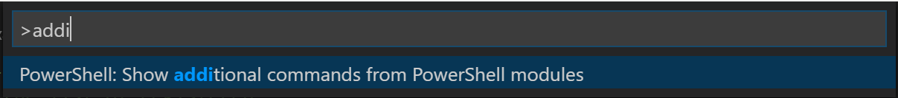
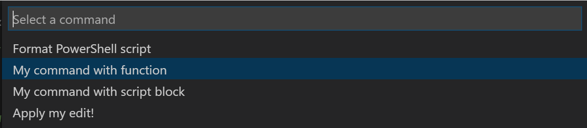

# Extending the Host Editor

PowerShell Editor Services exposes a common extensibility model which allows
you to write extension code in PowerShell that works across any editor that
uses PowerShell Editor Services.

## API Overview

### Introducing `$psEditor`

The entry point for the PowerShell Editor Services extensibility model is the `$psEditor`
object of the type @Microsoft.PowerShell.EditorServices.Services.PowerShellContext.EditorObject. For
those familiar with the PowerShell ISE's `$psISE` object, the `$psEditor` object is very
similar.  The primary difference is that this model has been generalized to work against
any editor which leverages PowerShell Editor Services for its PowerShell editing experience.

> NOTE: For now the `$psEditor` object is limited as it has just been
> introduced.  If you have ideas for other useful APIs it could expose
> please file an issue on our GitHub page.

This object gives access to all of the high-level services in the current
editing session.  For example, the @Microsoft.PowerShell.EditorServices.Services.PowerShellContext.EditorObject.Workspace
property gives access to the editor's workspace, allowing you to create or open files
in the editor.

### Usage Examples

#### Opening a file in the editor

```powershell
# Open the current user's profile for this editor
$psEditor.Workspace.OpenFile($profile)
```

#### Manipulating the user's active file buffer

```powershell
# Insert new text replacing the user's current selection
$context = $psEditor.GetEditorContext()
$context.CurrentFile.InsertText("# All your script are belong to us", $context.SelectedRange)
```

#### Setting the selection based on the cursor position

```powershell
# Set the selection from their cursor position to the end of the same line
$context = $psEditor.GetEditorContext()
$context.SetSelection($context.CursorPosition, $context.CursorPosition.GetLineEnd())
```

## Registering Editor Commands

The `$psEditor` object gives you the ability to write a script that can automate the
host editor when run inside of it.  However, you may not want to give a user a plain
script that performs some operation.  What if you'd prefer to add a new command to the
editor which can execute your code when the user invokes it?  The `Register-EditorCommand`
cmdlet allows you to register either a function, cmdlet, or ScriptBlock as a
command in the host editor.

### Registering a cmdlet or function command

```powershell
function Invoke-MyCommand {
    Write-Output "My command's function was invoked!"
}

Register-EditorCommand `
    -Name "MyModule.MyCommandWithFunction" `
    -DisplayName "My command with function" `
    -Function Invoke-MyCommand
```

### Registering a script block command

```powershell
Register-EditorCommand `
    -Name "MyModule.MyCommandWithScriptBlock" `
    -DisplayName "My command with script block" `
    -ScriptBlock { Write-Output "My command's script block was invoked!" }
```

### The @Microsoft.PowerShell.EditorServices.Services.PowerShellContext.EditorContext parameter

Your function, cmdlet, or ScriptBlock can optionally accept a single parameter
of type @Microsoft.PowerShell.EditorServices.Services.PowerShellContext.EditorContext which provides
information about the state of the host editor at the time your command was
invoked.  With this object you can easily perform operations like manipulatin the
state of the user's active editor buffer or changing the current selection.

The usual convention is that a `$context` parameter is added to your editor
command's function.  For now it is recommended that you fully specify the
type of the @Microsoft.PowerShell.EditorServices.Services.PowerShellContext.EditorContext object
so that you get full IntelliSense on your context parameter.

Here is an example of using the `$context` parameter:

```powershell
Register-EditorCommand `
    -Name "MyModule.MyEditorCommandWithContext" `
    -DisplayName "My command with context usage" `
    -ScriptBlock {
        param([Microsoft.PowerShell.EditorServices.Services.PowerShellContext.EditorContext]$context)
        Write-Output "The user's cursor is on line $($context.CursorPosition.Line)!"
    }
```

### Suppressing command output

If you would like for your editor command to run without its output being
written to the user's console, you can use the `-SuppressOutput` switch
parameter of the `Register-EditorCommand` cmdlet.  We recommend that you
use this parameter if your command does not need to write output to the
user's console.

Regardless of whether the `-SuppressOutput` parameter is used, any errors
that occur while running your editor command will be written to the user's
console.

## Using Editor Commands

If you've registered an editor command, either through your own code or
a module that you've installed, you can launch it using your editor's **Show
additional commands from PowerShell modules** command.  Running this command
will cause a list of commands to be displayed.

In Visual Studio Code, press `Ctrl+Shift+P` to open the command palette.  Type
the characters `addi` until you see the following item and then press `Enter`:



The list that appears next will show all of the editor commands that have
been registered with PowerShell code.  Selecting one of them will cause its
function or ScriptBlock to be executed.



Other editors should follow a similar pattern, exposing this command list through
a "Show additional commands" item in the command palette.

> NOTE: In the future we hope to be able to register editor commands at the top level
> so that these commands are easier to find and so that they also can be bound to
> hotkeys for quick access.

## Shipping an Extension Module

You can easily ship a module containing editor commands which get registered
if the module is loaded into an editor session.  Assuming that you've exported
a function or cmdlet named `Invoke-MyEditorCommand` in your module's psd1
file, you can add this code at the very end of your module's psm1 file:

```powershell
if ($psEditor) {
    Register-EditorCommand `
        -Name "MyModule.MyEditorCommand" `
        -DisplayName "My editor command" `
        -Function Invoke-MyEditorCommand `
        -SuppressOutput
}
```

The user will now be able to import your module in their host editor's profile and
your editor command will be immediately available after the PowerShell extension
in that editor starts up.

> NOTE: In the future we plan to provide an easy way for the user to opt-in
> to the automatic loading of any editor command modules that they've installed
> from the PowerShell Gallery.  If this interests you, please let us know on
> [this GitHub issue](https://github.com/PowerShell/PowerShellEditorServices/issues/215).
